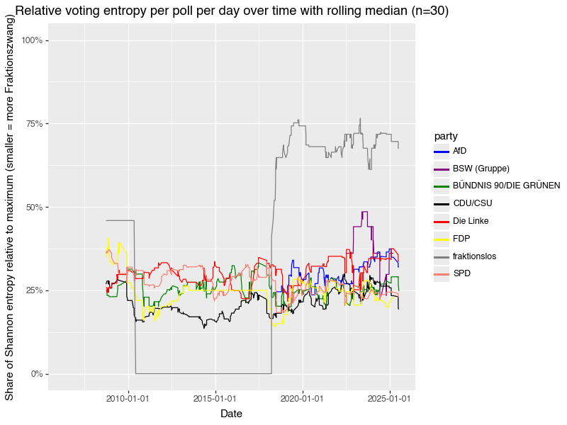

# "Namentliche Abstimmungen" in the Bundestag

> How do individual members of the federal German parliament (Bundestag) vote in "Namentliche Abstimmungen" (roll call votes)? How does the individual align with the different political parties? And how may the members vote on upcoming bills? The `bundestag` cli provides tools to assist to answer those questions by providing tools download and transform the required data.

[](https://mybinder.org/v2/gh/eschmidt42/bundestag/HEAD?labpath=docs%2Fanalysis-highlights.ipynb)
[](https://github.com/eschmidt42/bundestag/actions/workflows/ci.yml)
[](https://codecov.io/gh/eschmidt42/bundestag)

## Data sources

The German parliament makes roll call votes available as XLSX / XLS files (and PDFs ¯\\\_(ツ)\_/¯ ) here: https://www.bundestag.de/parlament/plenum/abstimmung/liste.

The NGO [abgeordnetenwatch](https://www.abgeordnetenwatch.de/) provides an [open API](https://www.abgeordnetenwatch.de/api) for a variety of related data. They also provide a great way of inspecting the voting behavior of members of parliament and their (non-)responses to question asked by the public.

## Analyses in this repo

### ["Fraktionszwang"](https://de.wikipedia.org/wiki/Fraktionsdisziplin)

Do all the members of a party always follow the party line? Clearly not. But that "discipline" is similar across parties. The significant deviation are the factionless, as measured [here](docs/fraktionszwang.md) using Shannon entropy. The curious mind could even estimate the energy it takes to enforce the disciplines.



### Embedded members of parliament

As a side effect of trying to predict the vote of individual members of parliament, we can obtain embeddings for each member. Doing so for the 2017-2021 legislative period, we find that they cluster into governing coalition (CDU/CSU & SPD) and the opposition:


If you want to see more check out [this site](docs/analysis-highlights.md) or [this notebook](docs/analysis-highlights.ipynb).

## How to install

```shell
git clone https://github.com/eschmidt42/bundestag
cd bundestag
make install-dev-env
```

## How to use

### The `bundestag` cli

A tool to assist with the data processing.

To get preprocessed data simply run
```shell
uv run bundestag download huggingface
```

For an overview over commands run
```shell
uv run bundestag --help
```

To download data from abgeordnetenwatch, for a specific legislature id
```shell
uv run bundestag download abgeordnetenwatch 132
```

To transform the downloaded data run
```shell
uv run bundestag transform abgeordnetenwatch 132
```

To find out the legislature id for the current Bundestag, visit [abgeordnetenwatch.de](https://www.abgeordnetenwatch.de/bundestag) and click on the "Open Data" button at the bottom of the page.

To download data from [bundestag.de](https://www.bundestag.de/parlament/plenum/abstimmung/liste)
```shell
uv run bundestag download bundestag-sheets --do-create-xlsx-uris-json
```

To transform the downloaded data run
```shell
uv run bundestag transform bundestag-sheet --sheet-source=json_file
```

Note: If you run `uv run bundestag transform abgeordnetenwatch 132` the data is damaged for some reason. To fix it run `uv run python scripts/fix_empty_fraction.py`

### The `get_xlsx_uris` cli

Pre-processing cli for `bundestag` cli.

    uv run get_xlsx_uris run --help

Module for collecting and storing XLSX URIs from Bundestag data sources. Also done with

    uv run bundestag download bundestag_sheet --do-create-xlsx-uris-json

### Jupyter notebooks

* [Fraktionszwang notebook](docs/fraktionszwang.ipynb)
* [embeddings notebook](docs/analysis-highlights.ipynb)
