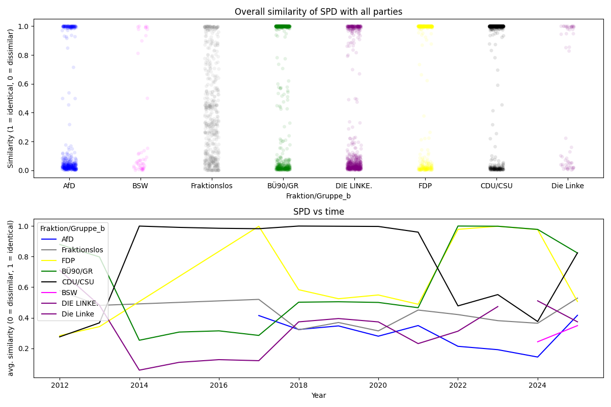

# Analysing "Namentliche Abstimmungen" in the Bundestag

> How close, in terms of roll call votes, are members of the parliament to the present parties? How predictable are individual votes for given polls? Answers to these questions can be found here.

### Data sources

Bundestag page `https://www.bundestag.de/parlament/plenum/abstimmung/liste`. Contains roll call votes with information on presence / absence and vote (yes/no/abstain) for each member of the Bundestag over a longer time period.

`abgeordnetenwatch.de` API `https://www.abgeordnetenwatch.de/api` (they also have a GUI [here](https://www.abgeordnetenwatch.de)). Contains information on politicians, parliaments, legislative periods and mandates including and beyond the Bundestag.


```python
%load_ext autoreload
%autoreload 2
```


```python
import os
from pathlib import Path

import matplotlib.pyplot as plt
import polars as pl
from fastai.tabular.all import (
    Categorify,
    CategoryBlock,
    RandomSplitter,
    TabularPandas,
    tabular_learner,
)
from functools import partial
from rich import print as pprint

from bundestag.fine_logging import setup_logging
from bundestag.paths import get_paths
from bundestag.ml.similarity import (
    get_votes_by_party,
    pivot_party_votes_df,
    prepare_votes_of_mdb,
    align_mdb_with_parties,
    compute_similarity,
    plot,
    align_party_with_all_parties,
)
from bundestag.ml.poll_clustering import SpacyTransformer, clean_text
from bundestag.ml.vote_prediction import (
    plot_predictions,
    get_embeddings,
    plot_politician_embeddings,
    plot_poll_embeddings,
)
from bundestag.gui import MdBGUI, PartyGUI
import logging
from plotnine import (
    scale_color_manual,
)
```


```python
logger = logging.getLogger(__name__)
setup_logging()
```


```python
# if this notebook is run via `make docs` then the environment variable is set
makedocs = os.getenv("MAKEDOCS") is not None
logger.info(f"Running nb with {makedocs=}")
```

Comment-in the below cell to download prepared data


```python
# import bundestag.data.download.huggingface as download_hf
# download_hf.run(Path("../data"))
```

### Part 1 - Who is similar to whom?
> Which party does a politicians voting behavior align the most with? Which parties are closest in terms of cast votes?

**Loading the data**

If you have cloned the repo you should already have a `bundestag.de_votes.parquet` file in the root directory of the repo. If not feel free to download that file directly.

If you want to have a closer look at the preprocessing please check out `nbs/00_html_parsing.ipynb`.


```python
_paths = get_paths(Path("../data"))
_fig_path = Path("./images")
```


```python
file = _paths.preprocessed_bundestag / "bundestag.de_votes.parquet"
```


```python
df = pl.read_parquet(file)
df.head(3)
```

Votes by party


```python
party_votes = get_votes_by_party(df)
```


```python
party_votes.head()
```

Re-arranging `party_votes`


```python
party_votes_pivoted = pivot_party_votes_df(party_votes)
party_votes_pivoted.head()
```

**Which party does a politicians voting behavior align the most with?**

Collecting the politicians votes


```python
mdb = "Peter Altmaier"
mdb_votes = prepare_votes_of_mdb(df, mdb)
mdb_votes.head()
```

Comparing the politician against the parties


```python
mdb_and_parties = align_mdb_with_parties(mdb_votes, party_votes_pivoted)
mdb_and_parties.head()
```


```python
mdb_vs_parties = compute_similarity(mdb_and_parties, "_party")
mdb_vs_parties.head(3)
```


```python
mdb_vs_parties["Fraktion/Gruppe_party"].value_counts()
```

Plotting


```python
plot(
    mdb_vs_parties,
    title_overall=f"Overall similarity of {mdb} with all parties",
    title_over_time=f"{mdb} vs time",
)
plt.tight_layout()
if makedocs:
    plt.savefig(_fig_path / "mdb_similarity_vs_time.png")
plt.show()
```


**Which parties are closest in terms of cast votes?**

Collecting party votes


```python
party_votes_pivoted.head()
```


```python
party = "SPD"
partyA_vs_rest = align_party_with_all_parties(party_votes_pivoted, party)
partyA_vs_rest.head(3)
```


```python
partyA_vs_rest = compute_similarity(partyA_vs_rest, suffix="_b")

partyA_vs_rest.head(3)
```

Plotting


```python
plot(
    partyA_vs_rest,
    title_overall=f"Overall similarity of {party} with all parties",
    title_over_time=f"{party} vs time",
    party_col="Fraktion/Gruppe_b",
)
plt.tight_layout()
if makedocs:
    plt.savefig(_fig_path / "party_similarity_vs_time.png")
plt.show()
```



**GUI to inspect similarities**

To make the above exploration more interactive, the class `MdBGUI` and `PartyGUI` was implemented to quickly go through the different parties and politicians


```python
mdb = MdBGUI(df)
```


```python
if not makedocs:
    display(mdb.render())
```


```python
party = PartyGUI(df)
```


```python
if not makedocs:
    display(party.render())
```

### Part 2 - How will a politician cast his or her vote?

The data used below was processed using `nbs/03_abgeordnetenwatch.ipynb`.


```python
path = _paths.preprocessed_abgeordnetenwatch
legislature_id = 111
file = path / f"polls_{legislature_id}.parquet"
```


```python
df_polls = pl.read_parquet(file)
```

#### Clustering polls using Latent Dirichlet Allocation (LDA)


```python
source_col = "poll_title"
nlp_col = f"{source_col}_nlp_processed"
num_topics = 5  # number of topics / clusters to identify

st = SpacyTransformer()
```


```python
df_polls.head()[source_col].map_elements(
    partial(clean_text, nlp=st.nlp), return_dtype=pl.List(pl.String)
)
```


```python
# load data and prepare text for modelling
df_polls_lda = df_polls.with_columns(
    **{
        nlp_col: pl.col(source_col).map_elements(
            partial(clean_text, nlp=st.nlp), return_dtype=pl.List(pl.String)
        )
    }
)
df_polls_lda.head()
```


```python
# modelling clusters
st.fit_lda(df_polls_lda[nlp_col].to_list(), num_topics=num_topics)
```


```python
# creating text features using fitted model
df_polls_lda, nlp_feature_cols = st.transform(
    df_polls_lda, col=nlp_col, return_new_cols=True
)

# inspecting clusters
display(df_polls_lda.head(3))
```


```python
st.lda_topics
```

#### Predicting votes

Loading data


```python
df_all_votes = pl.read_parquet(path / f"votes_{legislature_id}.parquet")
```


```python
df_mandates = pl.read_parquet(path / f"mandates_{legislature_id}.parquet")
```

Splitting data set into training and validation set. Splitting randomly here because it leads to an interesting result, albeit not very realistic for production.


```python
splits = RandomSplitter(valid_pct=0.2)(df_all_votes)
splits
```


```python
y_col = "vote"
```

Training a neural net to predict `vote` based on embeddings for `poll_id` and `politician name`


```python
df_all_votes.head()
```


```python
to = TabularPandas(
    df_all_votes.to_pandas(),
    cat_names=[
        "politician name",
        "poll_id",
    ],  # columns in `df_all_votes` to treat as categorical
    y_names=[y_col],  # column to use as a target for the model in `learn`
    procs=[Categorify],  # processing of features
    y_block=CategoryBlock,  # how to treat `y_names`, here as categories
    splits=splits,
)  # how to split the data

dls = to.dataloaders(bs=512)
learn = tabular_learner(dls)  # fastai function to set up a neural net for tabular data
```


```python
lrs = learn.lr_find()  # searches the learning rate
pprint(lrs)
```


```python
learn.fit_one_cycle(
    5, lrs.valley
)  # performs training using one-cycle hyperparameter schedule
```

**Predictions over unseen data**

Inspecting the predictions of the neural net over the validation set.


```python
df_mandates.head()
```


```python
df_all_votes.head()
```


```python
plot_predictions(
    learn, df_all_votes, df_mandates, df_polls, splits, n_worst_politicians=5
)
```

Splitting our dataset randomly leads to a surprisingly good accuracy of ~88% over the validation set. The most reasonable explanation is that the model encountered polls and how most politicians voted for them already during training.

This can be interpreted as, if it is known how most politicians will vote during a poll, then the vote of the remaining politicians is highly predictable. Splitting the data set by `poll_id`, as can be done using `vp.poll_splitter` leads to random chance predictions. Anything else would be surprising as well since the only available information provided to the model is who is voting.

**Visualising learned embeddings**

Besides the actual prediction it also is interesting to inspect what the model actually learned. This can sometimes lead to [surprises](https://github.com/entron/entity-embedding-rossmann).

So let's look at the learned embeddings


```python
learn.model.cpu()
embeddings = get_embeddings(learn)
```

To make sense of the embeddings for `poll_id` as well as `politician name` we apply Principal Component Analysis (so one still kind of understands what distances mean) and project down to 2d.

Using the information which party was most strongly (% of their votes being "yes"), so its strongest proponent, we color code the individual polls.


```python
embeddings_pl = {
    "politician name": pl.DataFrame(
        {
            "politician name__emb_component_0": embeddings["politician name"][
                "politician name__emb_component_0"
            ],
            "politician name__emb_component_1": embeddings["politician name"][
                "politician name__emb_component_1"
            ],
            "politician name": embeddings["politician name"]["politician name"],
        }
    ),
    "poll_id": pl.DataFrame(
        {
            "poll_id__emb_component_0": embeddings["poll_id"][
                "poll_id__emb_component_0"
            ].values[1:],
            "poll_id__emb_component_1": embeddings["poll_id"][
                "poll_id__emb_component_1"
            ].values[1:],
            "poll_id": [int(v) for v in embeddings["poll_id"]["poll_id"].values[1:]],
        }
    ),
}
```


```python
df_mandates["party"].value_counts()
```


```python
party_colors = scale_color_manual(
    breaks=[
        "AfD",
        "BSW",
        "DIE GRÜNEN",
        "CDU/CSU",
        "DIE LINKE",
        "FDP",
        "fraktionslos",
        "SPD",
    ],
    values=["blue", "purple", "green", "black", "red", "yellow", "grey", "salmon"],
)

fig = plot_poll_embeddings(
    df_all_votes, df_polls, embeddings_pl, df_mandates=df_mandates, colors=party_colors
)
fig.show()
if makedocs:
    fig.save(_fig_path / "poll_embeddings.png")
```


The politician embeddings are color coded using the politician's party membership


```python
fig = plot_politician_embeddings(df_all_votes, df_mandates, embeddings_pl, party_colors)
fig.show()
if makedocs:
    fig.save(_fig_path / "mandate_embeddings.png")
```


The politician embeddings may be the most surprising finding in its clarity. It seems we find for polls and politicians 2-3 clusters, but for politicians with a significant grouping of mandates associated with the government coalition. It seems we find one cluster for the government parties and one for the government opposition.


```python

```
