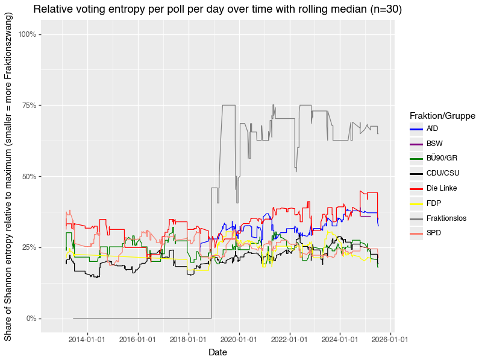

# Inspection roll call votes / namentliche Abstimmungen data for "Fraktionszwang"

Objective: Get insight into ["Fraktionszwang"](https://de.wikipedia.org/wiki/Fraktionsdisziplin) using voting behavior data from the bundestag and abgeordnetenwatch.

Fraktionszwang should become evident by how diverse the votes are by one party across different polls.

To collect data, if not already present in `../data/preprocessed` run

    uv run bundestag download huggingface


```python
%load_ext autoreload
%autoreload 2
```


```python
import polars as pl
from plotnine import (
    ggplot,
    aes,
    geom_point,
    labs,
    scale_y_continuous,
    facet_wrap,
    theme,
    geom_line,
    scale_color_manual,
)
import os
from pathlib import Path
from bundestag.fine_logging import setup_logging
import logging
from bundestag.paths import get_paths
import math
from bundestag.data.transform.abgeordnetenwatch.transform import (
    get_polls_parquet_path,
    get_votes_parquet_path,
    get_mandates_parquet_path,
)

logger = logging.getLogger(__name__)


def plot_poll_counts_over_time(df: pl.dataframe, x: str, y: str) -> ggplot:
    return (
        ggplot(df, aes("date", "n"))
        + geom_point()
        + labs(title="# polls per day over time", x="Date", y="# unique polls")
        + scale_y_continuous(breaks=[0, 2, 4, 6, 8, 10])
    )


def plot_voting_members_per_poll_over_time(
    df: pl.DataFrame, x: str, poll: str, member: str
) -> ggplot:
    members_per_poll_per_day_over_time = df.group_by([x, poll]).agg(
        pl.col(member).n_unique().alias("n")
    )
    return (
        ggplot(members_per_poll_per_day_over_time, aes(x, "n"))
        + geom_point()
        + labs(
            title="# Members voting per poll per day over time", x="Date", y="# members"
        )
    )


def compute_vote_shares(
    df: pl.DataFrame, x: str, poll: str, party: str, vote: str, member: str
) -> pl.DataFrame:
    member_votes_per_faction_per_poll_per_day_over_time = (
        df.group_by([x, poll, party, vote])
        .agg(pl.col(member).n_unique().alias("n"))
        .sort(x, poll, party, vote)
    )
    return member_votes_per_faction_per_poll_per_day_over_time.with_columns(
        (pl.col("n") / pl.sum("n").over([x, poll, party])).alias("vote share")
    )


def plot_voting_shares_over_time(
    df: pl.DataFrame, x: str, party: str, colors: scale_color_manual
) -> ggplot:
    return (
        ggplot(
            df,
            aes(x, "vote share", color="vote"),
        )
        + geom_point(alpha=0.3)
        + labs(
            title="Voting shares per poll per day over time",
            x="Date",
            y="Vote fraction",
        )
        + facet_wrap(party, ncol=1)
        + scale_y_continuous(limits=(0, 1), breaks=[0, 0.25, 0.5, 0.75, 1.0])
        + theme(figure_size=(10, 16), subplots_adjust={"hspace": 0.35})
        + colors
    )


def get_max_entropy(df: pl.DataFrame, col: str) -> float:
    return -math.log2(1 / df[col].n_unique())


def compute_entropies(
    df: pl.DataFrame, t: str, poll: str, party: str, vote: str
) -> pl.DataFrame:
    max_entropy = get_max_entropy(df, vote)
    return (
        df.with_columns(**{"log p": pl.col("vote share").log(base=2)})
        .group_by([t, poll, party])
        .agg(
            **{
                "shannon entropy": -pl.when(pl.col("vote share") > 0)
                .then(pl.col("vote share") * pl.col("log p"))
                .otherwise(0)
                .sum()
            }
        )
        .with_columns(
            **{
                "share of max shannon entropy [%]": pl.col("shannon entropy")
                / max_entropy
            }
        )
    )


def compute_rolling_median(
    df: pl.DataFrame,
    n: int,
    x: str,
    party: str,
    y: str = "share of max shannon entropy [%]",
) -> pl.DataFrame:
    return df.sort(x).with_columns(
        pl.col(y).rolling_median(window_size=n).over(party).alias("rolling_median")
    )


def plot_entropy_over_time(
    df: pl.DataFrame,
    party_colors: scale_color_manual,
    x: str = "date",
    y: str = "share of max shannon entropy [%]",
    color: str = "party",
) -> ggplot:
    return (
        ggplot(df, aes(x, y, color=color))
        + geom_point(alpha=0.3)
        + labs(
            title="Voting entropy per poll per day over time",
            x="Date",
            y="Shannon entropy (smaller = more Fraktionszwang)",
        )
        + facet_wrap(color, ncol=1)
        + theme(figure_size=(10, 16), subplots_adjust={"hspace": 0.35})
        + party_colors
        + scale_y_continuous(labels=lambda v: [f"{x * 100:.0f}%" for x in v])
    )


def plot_rolling_entropy_over_time(
    df: pl.DataFrame,
    party_colors: scale_color_manual,
    n_polls_to_average: int,
    x: str = "date",
    y: str = "rolling_median",
    color: str = "party",
) -> ggplot:
    return (
        ggplot(df, aes(x=x, color=color))
        + geom_line(aes(y=y))
        + labs(
            title=f"Relative voting entropy per poll per day over time with rolling median (n={n_polls_to_average})",
            x="Date",
            y="Share of Shannon entropy relative to maximum (smaller = more Fraktionszwang)",
        )
        + theme(figure_size=(8, 6), subplots_adjust={"hspace": 0.35})
        + party_colors
        + scale_y_continuous(
            labels=lambda v: [f"{x * 100:.0f}%" for x in v], limits=(0, 1)
        )
    )

# if this notebook is run via `make docs` then the environment variable is set
makedocs = os.getenv("MAKEDOCS") is not None
logger.info(f"Running nb with {makedocs=}")
```


```python
setup_logging(logging.INFO)

_fig_path = Path("./images")
paths = get_paths("../data")
paths
```


    Paths(root_path=PosixPath('../data'), raw='raw', preprocessed='preprocessed', abgeordnetenwatch='abgeordnetenwatch', bundestag='bundestag')


## Bundestag sheet data


```python
file = paths.preprocessed_bundestag / "bundestag.de_votes.parquet"
file
```


    PosixPath('../data/preprocessed/bundestag/bundestag.de_votes.parquet')


```python
data_bundestag = pl.read_parquet(file)

data_bundestag.head()
```


<div><style>
.dataframe > thead > tr,
.dataframe > tbody > tr {
  text-align: right;
  white-space: pre-wrap;
}
</style>
<small>shape: (5, 15)</small><table border="1" class="dataframe"><thead><tr><th>Wahlperiode</th><th>Sitzungnr</th><th>Abstimmnr</th><th>Fraktion/Gruppe</th><th>AbgNr</th><th>Name</th><th>Vorname</th><th>Titel</th><th>Bezeichnung</th><th>Bemerkung</th><th>sheet_name</th><th>date</th><th>title</th><th>issue</th><th>vote</th></tr><tr><td>i64</td><td>i64</td><td>i64</td><td>str</td><td>i64</td><td>str</td><td>str</td><td>str</td><td>str</td><td>str</td><td>str</td><td>datetime[ns]</td><td>str</td><td>str</td><td>str</td></tr></thead><tbody><tr><td>17</td><td>226</td><td>1</td><td>&quot;CDU/CSU&quot;</td><td>null</td><td>&quot;Aigner&quot;</td><td>&quot;Ilse&quot;</td><td>null</td><td>&quot;Ilse Aigner&quot;</td><td>null</td><td>&quot;&quot;</td><td>2013-03-01 00:00:00</td><td>&quot;Urheberrechtsgesetz 17/11470 u…</td><td>&quot;2013-03-01 Urheberrechtsgesetz…</td><td>&quot;ja&quot;</td></tr><tr><td>17</td><td>226</td><td>1</td><td>&quot;CDU/CSU&quot;</td><td>null</td><td>&quot;Altmaier&quot;</td><td>&quot;Peter&quot;</td><td>null</td><td>&quot;Peter Altmaier&quot;</td><td>null</td><td>&quot;&quot;</td><td>2013-03-01 00:00:00</td><td>&quot;Urheberrechtsgesetz 17/11470 u…</td><td>&quot;2013-03-01 Urheberrechtsgesetz…</td><td>&quot;nichtabgegeben&quot;</td></tr><tr><td>17</td><td>226</td><td>1</td><td>&quot;CDU/CSU&quot;</td><td>null</td><td>&quot;Aumer&quot;</td><td>&quot;Peter&quot;</td><td>null</td><td>&quot;Peter Aumer&quot;</td><td>null</td><td>&quot;&quot;</td><td>2013-03-01 00:00:00</td><td>&quot;Urheberrechtsgesetz 17/11470 u…</td><td>&quot;2013-03-01 Urheberrechtsgesetz…</td><td>&quot;ja&quot;</td></tr><tr><td>17</td><td>226</td><td>1</td><td>&quot;CDU/CSU&quot;</td><td>null</td><td>&quot;Bär&quot;</td><td>&quot;Dorothee&quot;</td><td>null</td><td>&quot;Dorothee Bär&quot;</td><td>null</td><td>&quot;&quot;</td><td>2013-03-01 00:00:00</td><td>&quot;Urheberrechtsgesetz 17/11470 u…</td><td>&quot;2013-03-01 Urheberrechtsgesetz…</td><td>&quot;nein&quot;</td></tr><tr><td>17</td><td>226</td><td>1</td><td>&quot;CDU/CSU&quot;</td><td>null</td><td>&quot;Bareiß&quot;</td><td>&quot;Thomas&quot;</td><td>null</td><td>&quot;Thomas Bareiß&quot;</td><td>null</td><td>&quot;&quot;</td><td>2013-03-01 00:00:00</td><td>&quot;Urheberrechtsgesetz 17/11470 u…</td><td>&quot;2013-03-01 Urheberrechtsgesetz…</td><td>&quot;nichtabgegeben&quot;</td></tr></tbody></table></div>


Use a single name for "Die Linke"


```python
data_bundestag["Fraktion/Gruppe"].value_counts()
```


<div><style>
.dataframe > thead > tr,
.dataframe > tbody > tr {
  text-align: right;
  white-space: pre-wrap;
}
</style>
<small>shape: (9, 2)</small><table border="1" class="dataframe"><thead><tr><th>Fraktion/Gruppe</th><th>count</th></tr><tr><td>str</td><td>u32</td></tr></thead><tbody><tr><td>&quot;BÜ90/GR&quot;</td><td>56200</td></tr><tr><td>&quot;DIE LINKE.&quot;</td><td>39747</td></tr><tr><td>&quot;SPD&quot;</td><td>125667</td></tr><tr><td>&quot;AfD&quot;</td><td>37462</td></tr><tr><td>&quot;BSW&quot;</td><td>480</td></tr><tr><td>&quot;Fraktionslos&quot;</td><td>2839</td></tr><tr><td>&quot;Die Linke&quot;</td><td>1792</td></tr><tr><td>&quot;CDU/CSU&quot;</td><td>177595</td></tr><tr><td>&quot;FDP&quot;</td><td>42351</td></tr></tbody></table></div>


```python
data_bundestag = data_bundestag.with_columns(
    **{
        "Fraktion/Gruppe": pl.when(pl.col("Fraktion/Gruppe").eq(pl.lit("DIE LINKE.")))
        .then(pl.lit("Die Linke"))
        .otherwise(pl.col("Fraktion/Gruppe"))
    }
)
```


```python
data_bundestag["Fraktion/Gruppe"].value_counts()
```


<div><style>
.dataframe > thead > tr,
.dataframe > tbody > tr {
  text-align: right;
  white-space: pre-wrap;
}
</style>
<small>shape: (8, 2)</small><table border="1" class="dataframe"><thead><tr><th>Fraktion/Gruppe</th><th>count</th></tr><tr><td>str</td><td>u32</td></tr></thead><tbody><tr><td>&quot;BÜ90/GR&quot;</td><td>56200</td></tr><tr><td>&quot;Die Linke&quot;</td><td>41539</td></tr><tr><td>&quot;FDP&quot;</td><td>42351</td></tr><tr><td>&quot;BSW&quot;</td><td>480</td></tr><tr><td>&quot;SPD&quot;</td><td>125667</td></tr><tr><td>&quot;AfD&quot;</td><td>37462</td></tr><tr><td>&quot;CDU/CSU&quot;</td><td>177595</td></tr><tr><td>&quot;Fraktionslos&quot;</td><td>2839</td></tr></tbody></table></div>


How many things are voted on per day over time?


```python
things_per_day_over_time = data_bundestag.group_by("date").agg(
    pl.col("Abstimmnr").n_unique().alias("n")
)
things_per_day_over_time.head()
```


<div><style>
.dataframe > thead > tr,
.dataframe > tbody > tr {
  text-align: right;
  white-space: pre-wrap;
}
</style>
<small>shape: (5, 2)</small><table border="1" class="dataframe"><thead><tr><th>date</th><th>n</th></tr><tr><td>datetime[ns]</td><td>u32</td></tr></thead><tbody><tr><td>2016-02-17 00:00:00</td><td>1</td></tr><tr><td>2019-11-29 00:00:00</td><td>3</td></tr><tr><td>2015-03-05 00:00:00</td><td>2</td></tr><tr><td>2022-05-19 00:00:00</td><td>2</td></tr><tr><td>2024-01-18 00:00:00</td><td>2</td></tr></tbody></table></div>


```python
p = plot_poll_counts_over_time(things_per_day_over_time, "date", "n")
p.show()
if makedocs:
    p.save(_fig_path / "bundestag_sheets_polls_over_time.png")
```


How many members vote per poll over time?


```python
p = plot_voting_members_per_poll_over_time(
    data_bundestag, "date", "Abstimmnr", "Bezeichnung"
)
p.show()
if makedocs:
    p.save(_fig_path / "bundestag_sheets_members_per_poll_over_time.png")
```


Count of vote types by date, poll and party over time.


```python
member_votes_per_faction_per_poll_per_day_over_time = compute_vote_shares(
    data_bundestag, "date", "Abstimmnr", "Fraktion/Gruppe", "vote", "Bezeichnung"
)
```


```python
member_votes_per_faction_per_poll_per_day_over_time.head()
```


<div><style>
.dataframe > thead > tr,
.dataframe > tbody > tr {
  text-align: right;
  white-space: pre-wrap;
}
</style>
<small>shape: (5, 6)</small><table border="1" class="dataframe"><thead><tr><th>date</th><th>Abstimmnr</th><th>Fraktion/Gruppe</th><th>vote</th><th>n</th><th>vote share</th></tr><tr><td>datetime[ns]</td><td>i64</td><td>str</td><td>str</td><td>u32</td><td>f64</td></tr></thead><tbody><tr><td>2012-10-18 00:00:00</td><td>1</td><td>&quot;BÜ90/GR&quot;</td><td>&quot;nein&quot;</td><td>59</td><td>0.867647</td></tr><tr><td>2012-10-18 00:00:00</td><td>1</td><td>&quot;BÜ90/GR&quot;</td><td>&quot;nichtabgegeben&quot;</td><td>9</td><td>0.132353</td></tr><tr><td>2012-10-18 00:00:00</td><td>1</td><td>&quot;CDU/CSU&quot;</td><td>&quot;ja&quot;</td><td>217</td><td>0.915612</td></tr><tr><td>2012-10-18 00:00:00</td><td>1</td><td>&quot;CDU/CSU&quot;</td><td>&quot;nichtabgegeben&quot;</td><td>20</td><td>0.084388</td></tr><tr><td>2012-10-18 00:00:00</td><td>1</td><td>&quot;Die Linke&quot;</td><td>&quot;nein&quot;</td><td>60</td><td>0.789474</td></tr></tbody></table></div>


```python
colors = scale_color_manual(
    breaks=["ja", "nein", "nichtabgegeben", "Enthaltung"],
    values=["green", "red", "grey", "orange"],
)
p = plot_voting_shares_over_time(
    member_votes_per_faction_per_poll_per_day_over_time,
    "date",
    "Fraktion/Gruppe",
    colors,
)
p.show()
if makedocs:
    p.save(_fig_path / "bundestag_sheets_voting_shares_over_time.png")
```

    /Users/eric/PetProjects/bundestag/.venv/lib/python3.12/site-packages/plotnine/themes/themeable.py:2486: FutureWarning: You no longer need to use subplots_adjust to make space for the legend or text around the panels. This parameter will be removed in a future version. You can still use 'plot_margin' 'panel_spacing' for your other spacing needs.


```python
entropy_per_poll_faction = compute_entropies(
    member_votes_per_faction_per_poll_per_day_over_time,
    "date",
    "Abstimmnr",
    "Fraktion/Gruppe",
    "vote",
)
entropy_per_poll_faction.head(2)
```


<div><style>
.dataframe > thead > tr,
.dataframe > tbody > tr {
  text-align: right;
  white-space: pre-wrap;
}
</style>
<small>shape: (2, 5)</small><table border="1" class="dataframe"><thead><tr><th>date</th><th>Abstimmnr</th><th>Fraktion/Gruppe</th><th>shannon entropy</th><th>share of max shannon entropy [%]</th></tr><tr><td>datetime[ns]</td><td>i64</td><td>str</td><td>f64</td><td>f64</td></tr></thead><tbody><tr><td>2017-12-12 00:00:00</td><td>5</td><td>&quot;FDP&quot;</td><td>0.42807</td><td>0.214035</td></tr><tr><td>2016-07-07 00:00:00</td><td>4</td><td>&quot;CDU/CSU&quot;</td><td>0.381382</td><td>0.190691</td></tr></tbody></table></div>


```python
party_colors = scale_color_manual(
    breaks=[
        "AfD",
        "BSW",
        "BÜ90/GR",
        "CDU/CSU",
        "Die Linke",
        "FDP",
        "Fraktionslos",
        "SPD",
    ],
    values=["blue", "purple", "green", "black", "red", "yellow", "grey", "salmon"],
)
p = plot_entropy_over_time(
    entropy_per_poll_faction, party_colors, x="date", color="Fraktion/Gruppe"
)
p.show()
if makedocs:
    p.save(_fig_path / "bundestag_sheets_voting_entropy_over_time.png")
```

    /Users/eric/PetProjects/bundestag/.venv/lib/python3.12/site-packages/plotnine/themes/themeable.py:2486: FutureWarning: You no longer need to use subplots_adjust to make space for the legend or text around the panels. This parameter will be removed in a future version. You can still use 'plot_margin' 'panel_spacing' for your other spacing needs.


Now we compute the rolling median of `shannon entropy` over `n_polls_to_average` polls for each `Fraktion/Gruppe`.


```python
n_polls_to_average = 30
entropy_per_poll_faction = compute_rolling_median(
    entropy_per_poll_faction, n_polls_to_average, "date", "Fraktion/Gruppe"
)
entropy_per_poll_faction.head()
```


<div><style>
.dataframe > thead > tr,
.dataframe > tbody > tr {
  text-align: right;
  white-space: pre-wrap;
}
</style>
<small>shape: (5, 6)</small><table border="1" class="dataframe"><thead><tr><th>date</th><th>Abstimmnr</th><th>Fraktion/Gruppe</th><th>shannon entropy</th><th>share of max shannon entropy [%]</th><th>rolling_median</th></tr><tr><td>datetime[ns]</td><td>i64</td><td>str</td><td>f64</td><td>f64</td><td>f64</td></tr></thead><tbody><tr><td>2012-10-18 00:00:00</td><td>1</td><td>&quot;SPD&quot;</td><td>0.644694</td><td>0.322347</td><td>null</td></tr><tr><td>2012-10-18 00:00:00</td><td>1</td><td>&quot;BÜ90/GR&quot;</td><td>0.563856</td><td>0.281928</td><td>null</td></tr><tr><td>2012-10-18 00:00:00</td><td>1</td><td>&quot;CDU/CSU&quot;</td><td>0.417456</td><td>0.208728</td><td>null</td></tr><tr><td>2012-10-18 00:00:00</td><td>1</td><td>&quot;FDP&quot;</td><td>0.423049</td><td>0.211524</td><td>null</td></tr><tr><td>2012-10-18 00:00:00</td><td>1</td><td>&quot;Die Linke&quot;</td><td>0.742488</td><td>0.371244</td><td>null</td></tr></tbody></table></div>


Now let's plot the original `shannon entropy` and the `shannon_entropy_rolling_median` to see the effect of the rolling median.


```python
p = plot_rolling_entropy_over_time(
    entropy_per_poll_faction,
    party_colors,
    n_polls_to_average,
    "date",
    color="Fraktion/Gruppe",
)
p.show()
if makedocs:
    p.save(_fig_path / "bundestag_sheets_rolling_voting_entropy_over_time.png")
```

    /Users/eric/PetProjects/bundestag/.venv/lib/python3.12/site-packages/plotnine/geoms/geom_path.py:100: PlotnineWarning: geom_path: Removed 29 rows containing missing values.
    /Users/eric/PetProjects/bundestag/.venv/lib/python3.12/site-packages/plotnine/themes/themeable.py:2486: FutureWarning: You no longer need to use subplots_adjust to make space for the legend or text around the panels. This parameter will be removed in a future version. You can still use 'plot_margin' 'panel_spacing' for your other spacing needs.




## Abgeordnetenwatch.de data

First, collect data for the individual legislative periods


```python
legislature_ids = [67, 83, 97, 111, 132, 161]
```


```python
tmp = []
for legislature_id in legislature_ids:
    p = get_polls_parquet_path(legislature_id, paths.preprocessed_abgeordnetenwatch)
    if not p.exists():
        continue
    _mandates = pl.read_parquet(p)
    _mandates = _mandates.with_columns(**{"legislature_id": legislature_id})
    tmp.append(_mandates)

polls = pl.concat(tmp, how="diagonal_relaxed")
polls.head(2), polls.tail(2)
```


    (shape: (2, 7)
     ┌─────────┬───────────────┬──────────────┬──────────────┬──────────────┬──────────────┬────────────┐
     │ poll_id ┆ poll_title    ┆ poll_first_c ┆ poll_descrip ┆ legislature_ ┆ legislature_ ┆ poll_date  │
     │ ---     ┆ ---           ┆ ommittee     ┆ tion         ┆ id           ┆ period       ┆ ---        │
     │ i64     ┆ str           ┆ ---          ┆ ---          ┆ ---          ┆ ---          ┆ str        │
     │         ┆               ┆ str          ┆ str          ┆ i32          ┆ str          ┆            │
     ╞═════════╪═══════════════╪══════════════╪══════════════╪══════════════╪══════════════╪════════════╡
     │ 724     ┆ Bundestagswah ┆ null         ┆ Grüne und    ┆ 67           ┆ Bundestag    ┆ 2009-07-03 │
     │         ┆ lrecht        ┆              ┆ Linke sind   ┆              ┆ 2005 - 2009  ┆            │
     │         ┆               ┆              ┆ damit ges…   ┆              ┆              ┆            │
     │ 723     ┆ AWACS-Einsatz ┆ null         ┆ Mit bis zu   ┆ 67           ┆ Bundestag    ┆ 2009-07-02 │
     │         ┆ in            ┆              ┆ 300 Bundeswe ┆              ┆ 2005 - 2009  ┆            │
     │         ┆ Afghanistan   ┆              ┆ hrsolda…     ┆              ┆              ┆            │
     └─────────┴───────────────┴──────────────┴──────────────┴──────────────┴──────────────┴────────────┘,
     shape: (2, 7)
     ┌─────────┬───────────────┬──────────────┬──────────────┬──────────────┬──────────────┬────────────┐
     │ poll_id ┆ poll_title    ┆ poll_first_c ┆ poll_descrip ┆ legislature_ ┆ legislature_ ┆ poll_date  │
     │ ---     ┆ ---           ┆ ommittee     ┆ tion         ┆ id           ┆ period       ┆ ---        │
     │ i64     ┆ str           ┆ ---          ┆ ---          ┆ ---          ┆ ---          ┆ str        │
     │         ┆               ┆ str          ┆ str          ┆ i32          ┆ str          ┆            │
     ╞═════════╪═══════════════╪══════════════╪══════════════╪══════════════╪══════════════╪════════════╡
     │ 6147    ┆ Fortsetzung   ┆ Auswärtiger  ┆ Die Bundesre ┆ 161          ┆ Bundestag    ┆ 2025-06-25 │
     │         ┆ des Bundesweh ┆ Ausschuss    ┆ gierung hat  ┆              ┆ 2025 - 2029  ┆            │
     │         ┆ reins…        ┆              ┆ einen …      ┆              ┆              ┆            │
     │ 6146    ┆ Fortsetzung   ┆ Auswärtiger  ┆ Der          ┆ 161          ┆ Bundestag    ┆ 2025-06-26 │
     │         ┆ des Bundesweh ┆ Ausschuss    ┆ Bundestag    ┆              ┆ 2025 - 2029  ┆            │
     │         ┆ reins…        ┆              ┆ hat über     ┆              ┆              ┆            │
     │         ┆               ┆              ┆ einen A…     ┆              ┆              ┆            │
     └─────────┴───────────────┴──────────────┴──────────────┴──────────────┴──────────────┴────────────┘)


```python
tmp = []
for legislature_id in legislature_ids:
    p = get_votes_parquet_path(legislature_id, paths.preprocessed_abgeordnetenwatch)
    if not p.exists():
        continue
    _mandates = pl.read_parquet(p)
    _mandates = _mandates.with_columns(**{"legislature_id": legislature_id})
    tmp.append(_mandates)

votes = pl.concat(tmp, how="diagonal_relaxed")
votes.head(2), votes.tail(2)
```


    (shape: (2, 8)
     ┌────────────┬─────────────┬─────────┬─────────┬────────────┬────────────┬────────────┬────────────┐
     │ mandate_id ┆ mandate     ┆ poll_id ┆ vote    ┆ reason_no_ ┆ reason_no_ ┆ politician ┆ legislatur │
     │ ---        ┆ ---         ┆ ---     ┆ ---     ┆ show       ┆ show_other ┆ name       ┆ e_id       │
     │ i64        ┆ str         ┆ i64     ┆ str     ┆ ---        ┆ ---        ┆ ---        ┆ ---        │
     │            ┆             ┆         ┆         ┆ str        ┆ str        ┆ str        ┆ i32        │
     ╞════════════╪═════════════╪═════════╪═════════╪════════════╪════════════╪════════════╪════════════╡
     │ 41075      ┆ Marion Seib ┆ 707     ┆ no_show ┆ null       ┆ null       ┆ Marion     ┆ 67         │
     │            ┆ (Bundestag  ┆         ┆         ┆            ┆            ┆ Seib       ┆            │
     │            ┆ 2005-20…    ┆         ┆         ┆            ┆            ┆            ┆            │
     │ 41067      ┆ Franz       ┆ 707     ┆ no_show ┆ null       ┆ null       ┆ Franz Münt ┆ 67         │
     │            ┆ Müntefering ┆         ┆         ┆            ┆            ┆ efering    ┆            │
     │            ┆ (Bundestag  ┆         ┆         ┆            ┆            ┆            ┆            │
     │            ┆ 2…          ┆         ┆         ┆            ┆            ┆            ┆            │
     └────────────┴─────────────┴─────────┴─────────┴────────────┴────────────┴────────────┴────────────┘,
     shape: (2, 8)
     ┌────────────┬─────────────┬─────────┬──────┬─────────────┬─────────────┬─────────────┬────────────┐
     │ mandate_id ┆ mandate     ┆ poll_id ┆ vote ┆ reason_no_s ┆ reason_no_s ┆ politician  ┆ legislatur │
     │ ---        ┆ ---         ┆ ---     ┆ ---  ┆ how         ┆ how_other   ┆ name        ┆ e_id       │
     │ i64        ┆ str         ┆ i64     ┆ str  ┆ ---         ┆ ---         ┆ ---         ┆ ---        │
     │            ┆             ┆         ┆      ┆ str         ┆ str         ┆ str         ┆ i32        │
     ╞════════════╪═════════════╪═════════╪══════╪═════════════╪═════════════╪═════════════╪════════════╡
     │ 69000      ┆ Vanessa-Kim ┆ 6155    ┆ yes  ┆ null        ┆ null        ┆ Vanessa-Kim ┆ 161        │
     │            ┆ Zobel       ┆         ┆      ┆             ┆             ┆ Zobel       ┆            │
     │            ┆ (Bundestag  ┆         ┆      ┆             ┆             ┆             ┆            │
     │            ┆ 2…          ┆         ┆      ┆             ┆             ┆             ┆            │
     │ 69002      ┆ Armand Zorn ┆ 6155    ┆ yes  ┆ null        ┆ null        ┆ Armand Zorn ┆ 161        │
     │            ┆ (Bundestag  ┆         ┆      ┆             ┆             ┆             ┆            │
     │            ┆ 2025 - …    ┆         ┆      ┆             ┆             ┆             ┆            │
     └────────────┴─────────────┴─────────┴──────┴─────────────┴─────────────┴─────────────┴────────────┘)


```python
tmp = []
for legislature_id in legislature_ids:
    p = get_mandates_parquet_path(legislature_id, paths.preprocessed_abgeordnetenwatch)
    if not p.exists():
        continue
    _mandates = pl.read_parquet(p)
    print(len(_mandates))
    _mandates = _mandates.with_columns(**{"legislature_id": legislature_id})
    tmp.append(_mandates)

mandates = pl.concat(tmp, how="diagonal_relaxed")
mandates.head(2), mandates.tail(2)
```

    611
    621
    632
    709
    733
    630


    (shape: (2, 17)
     ┌────────────┬───────────┬───────────┬───────────┬───┬───────────┬───────────┬───────────┬─────────┐
     │ legislatur ┆ legislatu ┆ mandate_i ┆ mandate   ┆ … ┆ fraction_ ┆ fraction_ ┆ all_parti ┆ party   │
     │ e_id       ┆ re_period ┆ d         ┆ ---       ┆   ┆ starts    ┆ ends      ┆ es        ┆ ---     │
     │ ---        ┆ ---       ┆ ---       ┆ str       ┆   ┆ ---       ┆ ---       ┆ ---       ┆ str     │
     │ i32        ┆ str       ┆ i64       ┆           ┆   ┆ list[str] ┆ list[str] ┆ list[str] ┆         │
     ╞════════════╪═══════════╪═══════════╪═══════════╪═══╪═══════════╪═══════════╪═══════════╪═════════╡
     │ 67         ┆ Bundestag ┆ 44904     ┆ Ingbert   ┆ … ┆ [null]    ┆ [""]      ┆ ["CDU/CSU ┆ CDU/CSU │
     │            ┆ 2005 -    ┆           ┆ Liebing   ┆   ┆           ┆           ┆ "]        ┆         │
     │            ┆ 2009      ┆           ┆ (Bundesta ┆   ┆           ┆           ┆           ┆         │
     │            ┆           ┆           ┆ g 200…    ┆   ┆           ┆           ┆           ┆         │
     │ 67         ┆ Bundestag ┆ 44768     ┆ Ulrich    ┆ … ┆ [null]    ┆ [""]      ┆ ["SPD"]   ┆ SPD     │
     │            ┆ 2005 -    ┆           ┆ Kelber    ┆   ┆           ┆           ┆           ┆         │
     │            ┆ 2009      ┆           ┆ (Bundesta ┆   ┆           ┆           ┆           ┆         │
     │            ┆           ┆           ┆ g 2005-…  ┆   ┆           ┆           ┆           ┆         │
     └────────────┴───────────┴───────────┴───────────┴───┴───────────┴───────────┴───────────┴─────────┘,
     shape: (2, 17)
     ┌────────────┬───────────┬───────────┬───────────┬───┬───────────┬───────────┬───────────┬─────────┐
     │ legislatur ┆ legislatu ┆ mandate_i ┆ mandate   ┆ … ┆ fraction_ ┆ fraction_ ┆ all_parti ┆ party   │
     │ e_id       ┆ re_period ┆ d         ┆ ---       ┆   ┆ starts    ┆ ends      ┆ es        ┆ ---     │
     │ ---        ┆ ---       ┆ ---       ┆ str       ┆   ┆ ---       ┆ ---       ┆ ---       ┆ str     │
     │ i32        ┆ str       ┆ i64       ┆           ┆   ┆ list[str] ┆ list[str] ┆ list[str] ┆         │
     ╞════════════╪═══════════╪═══════════╪═══════════╪═══╪═══════════╪═══════════╪═══════════╪═════════╡
     │ 161        ┆ Bundestag ┆ 68377     ┆ Knut      ┆ … ┆ [null]    ┆ [""]      ┆ ["CDU/CSU ┆ CDU/CSU │
     │            ┆ 2025 -    ┆           ┆ Abraham   ┆   ┆           ┆           ┆ "]        ┆         │
     │            ┆ 2029      ┆           ┆ (Bundesta ┆   ┆           ┆           ┆           ┆         │
     │            ┆           ┆           ┆ g 2025 -… ┆   ┆           ┆           ┆           ┆         │
     │ 161        ┆ Bundestag ┆ 68376     ┆ Sanae     ┆ … ┆ [null]    ┆ [""]      ┆ ["SPD"]   ┆ SPD     │
     │            ┆ 2025 -    ┆           ┆ Abdi (Bun ┆   ┆           ┆           ┆           ┆         │
     │            ┆ 2029      ┆           ┆ destag    ┆   ┆           ┆           ┆           ┆         │
     │            ┆           ┆           ┆ 2025 - 2… ┆   ┆           ┆           ┆           ┆         │
     └────────────┴───────────┴───────────┴───────────┴───┴───────────┴───────────┴───────────┴─────────┘)


```python
data_abgeordnetenwatch = polls.join(
    votes, on=["legislature_id", "poll_id"], how="left"
).join(mandates, on=["legislature_id", "mandate_id"], how="left")
```


```python
data_abgeordnetenwatch = data_abgeordnetenwatch.with_columns(
    **{"date": pl.col("poll_date").str.to_date(format="%Y-%m-%d")}
)
```


```python
with pl.Config(tbl_rows=15):
    display(data_abgeordnetenwatch["party"].value_counts(sort=True))
```


<div><style>
.dataframe > thead > tr,
.dataframe > tbody > tr {
  text-align: right;
  white-space: pre-wrap;
}
</style>
<small>shape: (12, 2)</small><table border="1" class="dataframe"><thead><tr><th>party</th><th>count</th></tr><tr><td>str</td><td>u32</td></tr></thead><tbody><tr><td>&quot;CDU/CSU&quot;</td><td>143375</td></tr><tr><td>&quot;SPD&quot;</td><td>105992</td></tr><tr><td>&quot;FDP&quot;</td><td>38755</td></tr><tr><td>&quot;DIE LINKE&quot;</td><td>29061</td></tr><tr><td>&quot;AfD&quot;</td><td>27763</td></tr><tr><td>&quot;DIE GRÜNEN&quot;</td><td>27320</td></tr><tr><td>&quot;BÜNDNIS 90/DIE GRÜNEN&quot;</td><td>18835</td></tr><tr><td>null</td><td>11910</td></tr><tr><td>&quot;Die Linke. (Gruppe)&quot;</td><td>4404</td></tr><tr><td>&quot;fraktionslos&quot;</td><td>3593</td></tr><tr><td>&quot;BSW (Gruppe)&quot;</td><td>1620</td></tr><tr><td>&quot;Die Linke&quot;</td><td>441</td></tr></tbody></table></div>


Clean the data a bit


```python
data_abgeordnetenwatch = data_abgeordnetenwatch.with_columns(
    **{
        "party": pl.when(
            pl.col("party").is_in(pl.lit(["DIE LINKE", "Die Linke. (Gruppe)"]))
        )
        .then(pl.lit("Die Linke"))
        .otherwise(pl.col("party"))
    }
).with_columns(
    **{
        "party": pl.when(pl.col("party").is_in(pl.lit(["DIE GRÜNEN"])))
        .then(pl.lit("BÜNDNIS 90/DIE GRÜNEN"))
        .otherwise(pl.col("party"))
    }
)
```


```python
with pl.Config(tbl_rows=15):
    display(data_abgeordnetenwatch["party"].value_counts(sort=True))
```


<div><style>
.dataframe > thead > tr,
.dataframe > tbody > tr {
  text-align: right;
  white-space: pre-wrap;
}
</style>
<small>shape: (9, 2)</small><table border="1" class="dataframe"><thead><tr><th>party</th><th>count</th></tr><tr><td>str</td><td>u32</td></tr></thead><tbody><tr><td>&quot;CDU/CSU&quot;</td><td>143375</td></tr><tr><td>&quot;SPD&quot;</td><td>105992</td></tr><tr><td>&quot;BÜNDNIS 90/DIE GRÜNEN&quot;</td><td>46155</td></tr><tr><td>&quot;FDP&quot;</td><td>38755</td></tr><tr><td>&quot;Die Linke&quot;</td><td>33906</td></tr><tr><td>&quot;AfD&quot;</td><td>27763</td></tr><tr><td>null</td><td>11910</td></tr><tr><td>&quot;fraktionslos&quot;</td><td>3593</td></tr><tr><td>&quot;BSW (Gruppe)&quot;</td><td>1620</td></tr></tbody></table></div>


```python
data_abgeordnetenwatch.filter(pl.col("party").is_null()).group_by("legislature_id").agg(
    **{"mandates": pl.col("mandate_id").n_unique()}
)
```


<div><style>
.dataframe > thead > tr,
.dataframe > tbody > tr {
  text-align: right;
  white-space: pre-wrap;
}
</style>
<small>shape: (6, 2)</small><table border="1" class="dataframe"><thead><tr><th>legislature_id</th><th>mandates</th></tr><tr><td>i32</td><td>u32</td></tr></thead><tbody><tr><td>67</td><td>23</td></tr><tr><td>83</td><td>31</td></tr><tr><td>97</td><td>26</td></tr><tr><td>111</td><td>39</td></tr><tr><td>132</td><td>39</td></tr><tr><td>161</td><td>3</td></tr></tbody></table></div>


```python
things_per_day_over_time = data_abgeordnetenwatch.group_by("date").agg(
    pl.col("poll_id").n_unique().alias("n")
)
things_per_day_over_time.head()
```


<div><style>
.dataframe > thead > tr,
.dataframe > tbody > tr {
  text-align: right;
  white-space: pre-wrap;
}
</style>
<small>shape: (5, 2)</small><table border="1" class="dataframe"><thead><tr><th>date</th><th>n</th></tr><tr><td>date</td><td>u32</td></tr></thead><tbody><tr><td>2019-11-27</td><td>1</td></tr><tr><td>2018-11-08</td><td>5</td></tr><tr><td>2024-12-16</td><td>1</td></tr><tr><td>2023-06-23</td><td>4</td></tr><tr><td>2018-02-22</td><td>1</td></tr></tbody></table></div>


```python
p = plot_poll_counts_over_time(things_per_day_over_time, "date", "n")
p.show()
if makedocs:
    p.save(_fig_path / "abgeordnetenwatch_polls_over_time.png")
```


```python
p = plot_voting_members_per_poll_over_time(
    data_abgeordnetenwatch, "date", "poll_id", "mandate_id"
)
p.show()
if makedocs:
    p.save(_fig_path / "abgeordnetenwatch_members_per_poll_over_time.png")
```


```python
member_votes_per_faction_per_poll_per_day_over_time = compute_vote_shares(
    data_abgeordnetenwatch, "date", "poll_id", "party", "vote", "mandate_id"
)
```


```python
colors = scale_color_manual(
    breaks=["yes", "no", "no_show", "abstain"],
    values=["green", "red", "grey", "orange"],
)
p = plot_voting_shares_over_time(
    member_votes_per_faction_per_poll_per_day_over_time, "date", "party", colors
)
p.show()
if makedocs:
    p.save(_fig_path / "abgeordnetenwatch_voting_shares_over_time.png")
```

    /Users/eric/PetProjects/bundestag/.venv/lib/python3.12/site-packages/plotnine/themes/themeable.py:2486: FutureWarning: You no longer need to use subplots_adjust to make space for the legend or text around the panels. This parameter will be removed in a future version. You can still use 'plot_margin' 'panel_spacing' for your other spacing needs.


```python
entropy_per_poll_faction = compute_entropies(
    member_votes_per_faction_per_poll_per_day_over_time,
    "date",
    "poll_id",
    "party",
    "vote",
)
entropy_per_poll_faction.head()
```


<div><style>
.dataframe > thead > tr,
.dataframe > tbody > tr {
  text-align: right;
  white-space: pre-wrap;
}
</style>
<small>shape: (5, 5)</small><table border="1" class="dataframe"><thead><tr><th>date</th><th>poll_id</th><th>party</th><th>shannon entropy</th><th>share of max shannon entropy [%]</th></tr><tr><td>date</td><td>i64</td><td>str</td><td>f64</td><td>f64</td></tr></thead><tbody><tr><td>2019-05-09</td><td>1680</td><td>&quot;fraktionslos&quot;</td><td>1.721928</td><td>0.860964</td></tr><tr><td>2020-11-25</td><td>3959</td><td>&quot;AfD&quot;</td><td>0.807751</td><td>0.403876</td></tr><tr><td>2018-05-17</td><td>1333</td><td>&quot;BÜNDNIS 90/DIE GRÜNEN&quot;</td><td>0.554778</td><td>0.277389</td></tr><tr><td>2023-04-28</td><td>5011</td><td>&quot;CDU/CSU&quot;</td><td>0.635973</td><td>0.317987</td></tr><tr><td>2019-06-06</td><td>1684</td><td>&quot;CDU/CSU&quot;</td><td>0.291818</td><td>0.145909</td></tr></tbody></table></div>


```python
party_colors = scale_color_manual(
    breaks=[
        "AfD",
        "BSW (Gruppe)",
        "BÜNDNIS 90/DIE GRÜNEN",
        "CDU/CSU",
        "Die Linke",
        "FDP",
        "fraktionslos",
        "SPD",
    ],
    values=["blue", "purple", "green", "black", "red", "yellow", "grey", "salmon"],
)
p = plot_entropy_over_time(entropy_per_poll_faction, party_colors)
p.show()
if makedocs:
    p.save(_fig_path / "abgeordnetenwatch_voting_entropy_over_time.png")
```

    /Users/eric/PetProjects/bundestag/.venv/lib/python3.12/site-packages/plotnine/themes/themeable.py:2486: FutureWarning: You no longer need to use subplots_adjust to make space for the legend or text around the panels. This parameter will be removed in a future version. You can still use 'plot_margin' 'panel_spacing' for your other spacing needs.


```python
n_polls_to_average = 30
entropy_per_poll_faction = compute_rolling_median(
    entropy_per_poll_faction,
    n_polls_to_average,
    "date",
    "party",
    y="share of max shannon entropy [%]",
)
```


```python
p = plot_rolling_entropy_over_time(
    entropy_per_poll_faction.filter(pl.col("party").is_not_null()),
    party_colors,
    n_polls_to_average,
)
p.show()
if makedocs:
    p.save(_fig_path / "abgeordnetenwatch_rolling_voting_entropy_over_time.png")
```

    /Users/eric/PetProjects/bundestag/.venv/lib/python3.12/site-packages/plotnine/geoms/geom_path.py:100: PlotnineWarning: geom_path: Removed 29 rows containing missing values.
    /Users/eric/PetProjects/bundestag/.venv/lib/python3.12/site-packages/plotnine/themes/themeable.py:2486: FutureWarning: You no longer need to use subplots_adjust to make space for the legend or text around the panels. This parameter will be removed in a future version. You can still use 'plot_margin' 'panel_spacing' for your other spacing needs.


