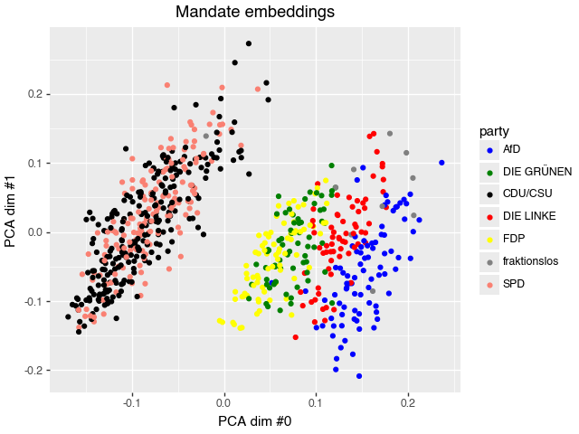

# "Namentliche Abstimmungen"  in the Bundestag

> How do individual members of the federal German parliament (Bundestag) vote in "Namentliche Abstimmungen" (roll call votes)? How does the individual align with the different political parties? And how may the members vote on upcoming bills? All this here.

## Context

The German Parliament is so friendly to put all votes of all members into readable XLSX / XLS files (and PDFs ¯\\\_(ツ)\_/¯ ). Those files  can be found here: https://www.bundestag.de/parlament/plenum/abstimmung/liste.

Furthermore, the organisation [abgeordnetenwatch](https://www.abgeordnetenwatch.de/) offers a great platform to get to know the individual politicians and their behavior as well as an [open API](https://www.abgeordnetenwatch.de/api) to request data.

## Purpose of this repo

The purpose of this repo is to help collect roll call votes from the parliament's site directly or via abgeordnetenwatch's API and make them available for analysis / modelling. This may be particularly interesting if you want to see what your local member of the parliament has been up to in terms of public roll call votes relative to the parties, or how individual parties agree in their votes, this dataset may be interesting for you.

Since the files on the bundestag website are stored in a way making it tricky to automatically crawl them, a bit of manual work is required to generate that dataset. But don't fret! Quite a few recent roll call votes (as of the publishing of this repo) are already prepared for you. But if older or more recent roll call votes are missing, convenience tools to reduce your manual effort are demonstrated below. An alternative route to get the same and more data (on politicians and local parliaments as well) is via the abgeordnetenwatch route.

For your inspiration, I have also included an analysis on how similar parties voted / how similar to parties individual MdBs votes and a small machine learning model which predicts the individual votes of parliament. Teaser: the "fraktionsszwang" seems to exist but is not absolute and the data shows 😁.

## Embedded members of parliament

As a side effect of trying to predict the vote of individual members of parliament we can obtain embeddings for each member. Doing so for the 2017-2021 legislative period, we find that they cluster into governing coalition (CDU/CSU & SPD) and the opposition:

If you want to see more [check out this site](analysis-highlights.md).
