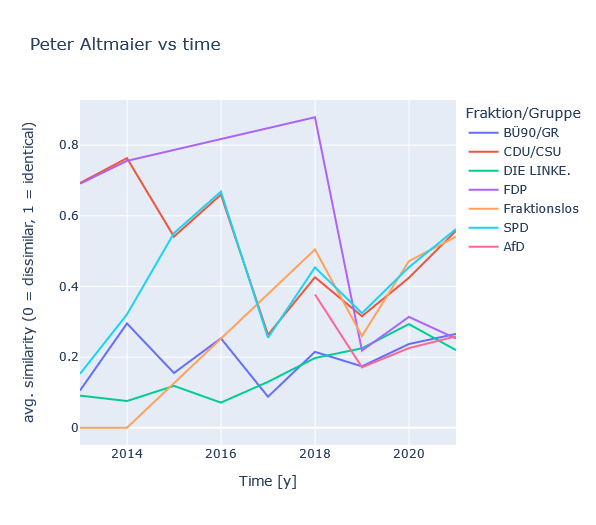
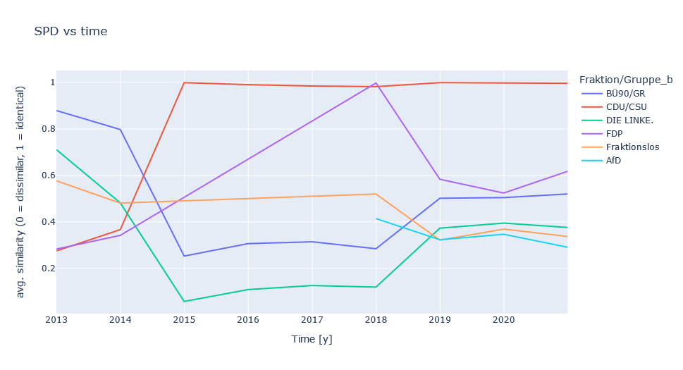
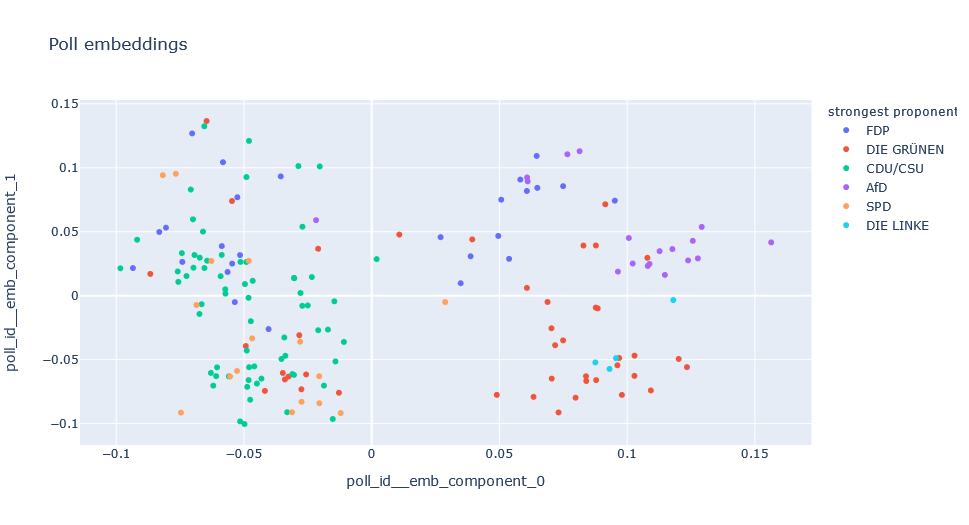
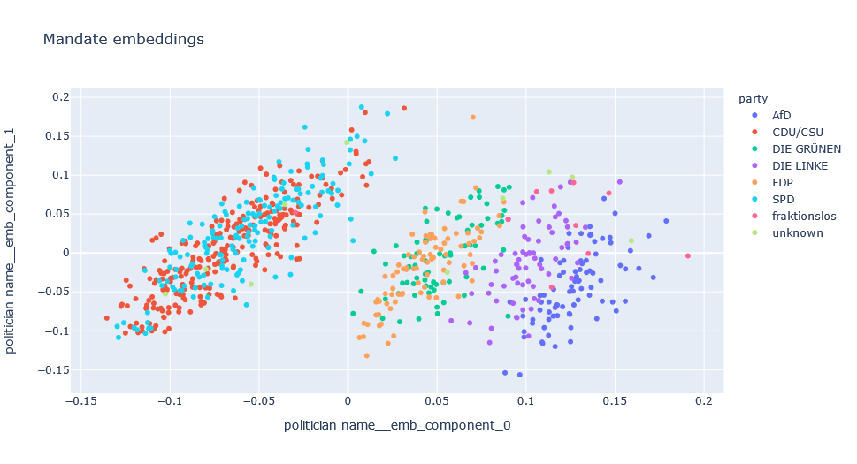

# "Namentliche Abstimmungen"  in the Bundestag

> Parse and inspect "Namentliche Abstimmungen" (roll call votes) in the Bundestag (the federal German parliament)

[](https://mybinder.org/v2/gh/eschmidt42/bundestag/data?labpath=README.ipynb) [](https://github.com/eschmidt42/bundestag/actions/workflows/unittests.yml) [](https://codecov.io/gh/eschmidt42/bundestag)

## Context

The German Parliament is so friendly to put all votes of all members into readable XLSX / XLS files (and PDFs ¯\\\_(ツ)\_/¯ ). Those files  can be found here: https://www.bundestag.de/parlament/plenum/abstimmung/liste.

Furthermore, the organisation [abgeordnetenwatch](https://www.abgeordnetenwatch.de/) offers a great platform to get to know the individual politicians and their behavior as well as an [open API](https://www.abgeordnetenwatch.de/api) to request data.

## Purpose of this repo

The purpose of this repo is to help collect roll call votes from the parliament's site directly or via abgeordnetenwatch's API and make them available for analysis / modelling. This may be particularly interesting for the upcoming election in 2021. E.g., if you want to see what your local member of the parliament has been up to in terms of public roll call votes relative to the parties, or how individual parties agree in their votes, this dataset may be interesting for you.

Since the files on the bundestag website are stored in a way making it tricky to automatically crawl them, a bit of manual work is required to generate that dataset. But don't fret! Quite a few recent roll call votes (as of the publishing of this repo) are already prepared for you. But if older or more recent roll call votes are missing, convenience tools to reduce your manual effort are demonstrated below. An alternative route to get the same and more data (on politicians and local parliaments as well) is via the abgeordnetenwatch route.

For your inspiration, I have also included an analysis on how similar parties voted / how similar to parties individual MdBs votes and a small machine learning model which predicts the individual votes of parliament. Teaser: the "fraktionsszwang" seems to exist but is not absolute and the data shows 😁.

## How to install

`pip install bundestag`

## How to use

### `bundestag` command line interface to process data

For an overview over commands run
```shell
bundestag --help
```

To download data from abgeordnetenwatch, for a specific legislature id
```shell
bundestag download abgeordnetenwatch 132
```

To transform the downloaded data run
```shell
bundestag transform abgeordnetenwatch 132
````

To find out the legislature id for the current Bundestag, visit [abgeordnetenwatch.de](https://www.abgeordnetenwatch.de/bundestag) and click on the "Open Data" button at the bottom of the page.

To download prepared raw and transformed data from huggingface run
```shell
bundestag download huggingface
```

### When developing

See
```shell
make help
```

for implemented commands to manage the project.

To get started run
```shell
make venv
make install-dev
```

To build the docs run
```shell
make docs
```

to create the readme files and
```shell
python3 -m mkdocs serve
```

to test out the autogenerated documentation that will be deployed to github pages.

### Notebooks / analyses

For detailed explanations see:
- parse data from bundestag.de $\rightarrow$ `nbs/00_html_parsing.ipynb`
- parse data from abgeordnetenwatch.de $\rightarrow$ `nbs/03_abgeordnetenwatch.ipynb`
- analyze party / abgeordneten similarity $\rightarrow$ `nbs/01_similarities.ipynb`
- cluster polls $\rightarrow$ `nbs/04_poll_clustering.ipynb`
- predict politician votes $\rightarrow$ `nbs/05_predicting_votes.ipynb`

For a short overview of the highlights see below.

### Data sources

* Bundestag page `https://www.bundestag.de/parlament/plenum/abstimmung/liste`:
    * contains: Roll call votes with information on presence / absence and vote (yes/no/abstain) for each member of the Bundestag over a longer time period
    * used in: `nbs/01_similarities.ipynb` and `nbs/02_gui.ipynb` to investigate similarities between parties and politicians based on voting behavior
* abgeordnetenwatch API `https://www.abgeordnetenwatch.de/api` (they also have a GUI [here](https://www.abgeordnetenwatch.de)):
    * contains information on politicians, parliaments, legislative periods and mandates including and beyond the Bundestag
    * used in: `nbs/04_poll_clustering.ipynb` and `nbs/05_predicting_votes.ipynb` to cluster polls by description and predict votes of individual politicians respectively

### Handling data

#### Downloading raw data

Abgeordnetenwatch via cli
```shell
bundestag download abgeordnetenwatch 111
```

or via python
```python
bundestag.data.download.abgeordnetenwatch.run(111,raw_path=Path("data/raw/abgeordnetenwatch"),preprocessed_path=Path("data/preprocessed/abgeordnetenwatch"))
```

Bundestag sheets via cli
```shell
bundestag download bundestag_sheet
```

or via python
```python
bundestag.data.download.bundestag_sheets.run(html_path=Path("data/raw/bundestag/htm_files"),sheet_path=Path("data/preprocessed/bundestag/sheets"))
```

#### Transforming the data

Abgeordnetenwatch via cli
```shell
bundestag transform abgeordnetenwatch 111
```

or via python
```python
bundestag.data.transform.abgeordnetenwatch.run(111,raw_path=Path("data/raw/abgeordnetenwatch"),preprocessed_path=Path("data/preprocessed/abgeordnetenwatch"))
```

Bundestag sheets via cli
```shell
bundestag transform bundestag_sheet
```

or via python
```python
bundestag.data.download.bundestag_sheets.run(html_path=Path("data/raw/bundestag/htm_files"),sheet_path=Path("data/raw/bundestag/sheets"), preprocessed_path=Path("data/preprocessed/bundestag"))
```

#### Downloading raw and preprocessed data from huggingface

Via cli
```shell
bundestag download huggingface
```

or via python
```python
bundestag.data.download.huggingface.run(Path("data"))
```

### Analysis highlights

Note: the cells using `pd.read_parquet` below only work for `legislature_id` 111 if the data was previously downloaded either with the `bundestag` cli tool or by using the cells below, by commenting them in.


```python
%load_ext autoreload
%autoreload 2
```


```python
from pathlib import Path

import pandas as pd
from fastai.tabular.all import RandomSplitter, TabularPandas, Categorify, CategoryBlock, tabular_learner
from rich import print as pprint

import bundestag.data.download.huggingface as download_hf
import bundestag.paths as paths
import bundestag.poll_clustering as pc
import bundestag.similarity as sim
import bundestag.vote_prediction as vp
from bundestag.gui import MdBGUI, PartyGUI

import matplotlib.pyplot as plt
```

Comment-in the below cell to download prepared data


```python
# download_hf.run(Path("data"))
```

### Part 1 - Who is similar to whom?
> Which party does a politicians voting behavior align the most with? Which parties are closest in terms of cast votes?

**Loading the data**

If you have cloned the repo you should already have a `bundestag.de_votes.parquet` file in the root directory of the repo. If not feel free to download that file directly.

If you want to have a closer look at the preprocessing please check out `nbs/00_html_parsing.ipynb`.


```python
_paths = paths.get_paths("data")
```


```python
file = _paths.preprocessed_bundestag / "bundestag.de_votes.parquet"
```


```python
df = pd.read_parquet(path=file)
df.head(3).T
```

Votes by party


```python
party_votes = sim.get_votes_by_party(df)
```

Re-arranging `party_votes`


```python
party_votes_pivoted = sim.pivot_party_votes_df(party_votes)
party_votes_pivoted.head()
```

**Which party does a politicians voting behavior align the most with?**

Collecting the politicians votes


```python
mdb = "Peter Altmaier"
mdb_votes = sim.prepare_votes_of_mdb(df, mdb)
mdb_votes.head()
```

Comparing the politician against the parties


```python
mdb_vs_parties = sim.align_mdb_with_parties(
    mdb_votes, party_votes_pivoted
).pipe(sim.compute_similarity, lsuffix="mdb", rsuffix="party")
mdb_vs_parties.head(3).T
```

Plotting


```python
sim.plot(
    mdb_vs_parties,
    title_overall=f"Overall similarity of {mdb} with all parties",
    title_over_time=f"{mdb} vs time",
)
plt.tight_layout()
plt.show()
```



**Which parties are closest in terms of cast votes?**

Collecting party votes


```python
party = "SPD"
partyA_vs_rest = sim.align_party_with_all_parties(
    party_votes_pivoted, party
).pipe(sim.compute_similarity, lsuffix="a", rsuffix="b")

partyA_vs_rest.head(3).T
```

Plotting


```python
sim.plot(
    partyA_vs_rest,
    title_overall=f"Overall similarity of {party} with all parties",
    title_over_time=f"{party} vs time",
    party_col="Fraktion/Gruppe_b",
)
plt.tight_layout()
plt.show()
```



**GUI to inspect similarities**

To make the above exploration more interactive, the class `MdBGUI` and `PartyGUI` was implemented to quickly go through the different parties and politicians


```python
mdb = MdBGUI(df)
```


```python
mdb.render()
```


```python
party = PartyGUI(df)
```


```python
party.render()
```

### Part 2 - How will a politician cast his or her vote?

The data used below was processed using `nbs/03_abgeordnetenwatch.ipynb`.


```python
path = _paths.preprocessed_abgeordnetenwatch
legislature_id = 111
file = path / f"df_polls_{legislature_id}.parquet"
```


```python
df_polls = pd.read_parquet(path=file)
```

#### Clustering polls using Latent Dirichlet Allocation (LDA)


```python
source_col = "poll_title"
nlp_col = f"{source_col}_nlp_processed"
num_topics = 5  # number of topics / clusters to identify

st = pc.SpacyTransformer()

# load data and prepare text for modelling
df_polls_lda = df_polls.copy().assign(
    **{nlp_col: lambda x: pc.clean_text(x, col=source_col, nlp=st.nlp)}
)

# modelling clusters
st.fit(df_polls_lda[nlp_col].values, mode="lda", num_topics=num_topics)

# creating text features using fitted model
df_polls_lda, nlp_feature_cols = df_polls_lda.pipe(
    st.transform, col=nlp_col, return_new_cols=True
)

# inspecting clusters
display(df_polls_lda.head(3).T)
```


```python
pc.pca_plot_lda_topics(df_polls_lda, st, source_col, nlp_feature_cols)
```

#### Predicting votes

Loading data


```python
df_all_votes = pd.read_parquet(
    path=path / f"df_all_votes_{legislature_id}.parquet"
)
```


```python
df_mandates = pd.read_parquet(
    path=path / f"df_mandates_{legislature_id}.parquet"
)
```

Splitting data set into training and validation set. Splitting randomly here because it leads to an interesting result, albeit not very realistic for production.


```python
splits = RandomSplitter(valid_pct=0.2)(df_all_votes)
y_col = "vote"
```

Training a neural net to predict `vote` based on embeddings for `poll_id` and `politician name`


```python
df_all_votes.head()
```


```python
to = TabularPandas(
    df_all_votes,
    cat_names=[
        "politician name",
        "poll_id",
    ],  # columns in `df_all_votes` to treat as categorical
    y_names=[y_col],  # column to use as a target for the model in `learn`
    procs=[Categorify],  # processing of features
    y_block=CategoryBlock,  # how to treat `y_names`, here as categories
    splits=splits,
)  # how to split the data

dls = to.dataloaders(bs=512)
learn = tabular_learner(
    dls
)  # fastai function to set up a neural net for tabular data
```


```python
lrs = learn.lr_find()  # searches the learning rate
pprint(lrs)
```


```python
learn.fit_one_cycle(
    5, lrs.valley
)  # performs training using one-cycle hyperparameter schedule
```

**Predictions over unseen data**

Inspecting the predictions of the neural net over the validation set.


```python
vp.plot_predictions(
    learn, df_all_votes, df_mandates, df_polls, splits, n_worst_politicians=5
)
```

Splitting our dataset randomly leads to a surprisingly good accuracy of ~88% over the validation set. The most reasonable explanation is that the model encountered polls and how most politicians voted for them already during training.

This can be interpreted as, if it is known how most politicians will vote during a poll, then the vote of the remaining politicians is highly predictable. Splitting the data set by `poll_id`, as can be done using `vp.poll_splitter` leads to random chance predictions. Anything else would be surprising as well since the only available information provided to the model is who is voting.

**Visualising learned embeddings**

Besides the actual prediction it also is interesting to inspect what the model actually learned. This can sometimes lead to [surprises](https://github.com/entron/entity-embedding-rossmann).

So let's look at the learned embeddings


```python
embeddings = vp.get_embeddings(learn)
```

To make sense of the embeddings for `poll_id` as well as `politician name` we apply Principal Component Analysis (so one still kind of understands what distances mean) and project down to 2d.

Using the information which party was most strongly (% of their votes being "yes"), so its strongest proponent, we color code the individual polls.


```python
vp.plot_poll_embeddings(
    df_all_votes, df_polls, embeddings, df_mandates=df_mandates
)
```



The politician embeddings are color coded using the politician's party membership


```python
vp.plot_politician_embeddings(df_all_votes, df_mandates, embeddings)
```



The politician embeddings may be the most surprising finding in its clarity. It seems we find for polls and politicians 2-3 clusters, but for politicians with a significant grouping of mandates associated with the government coalition. It seems we find one cluster for the government parties and one for the government opposition.


```python

```
